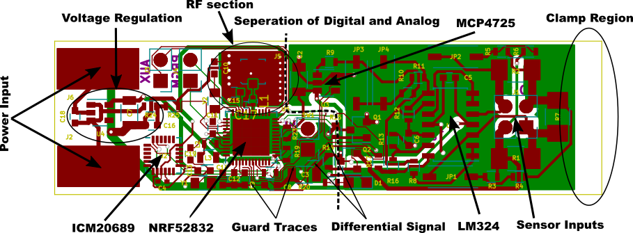
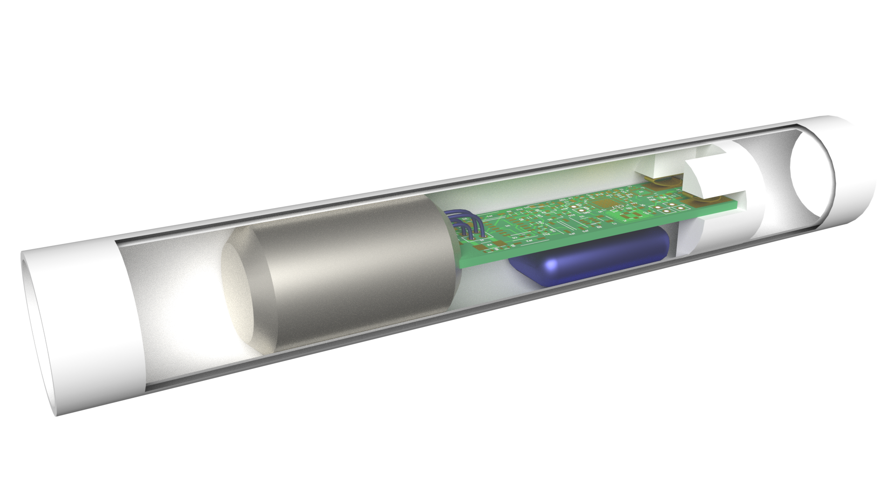

# Telsys Hardware

Telsys is a small integrated wireless bluetooth low energy measurement amplifier and digitizer. Its primary intention is the use with strain gauges in sensor integrated structures. Sutch as the strain reporting pipe seen below. The firmware for the nrf52 used in this design can be found here: https://github.com/IMbackK/TelsysFW. A GUI client for reciveing the data as well as to examine the data can be found here: https://github.com/IMbackK/TelsysMaster

These are kicad files detailing the shematic and board design of the Telsys device.
Kicad can be found here: https://www.kicad.org/

License: gpl-3.0 only, see license/GPL.txt

